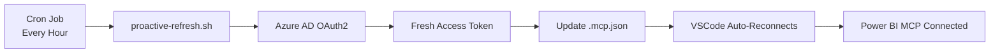

# Power BI MCP Token Auto-Refresh

**Automatic Azure AD token refresh for Power BI Model Context Protocol (MCP) servers**

[](https://opensource.org/licenses/MIT)
[](https://www.gnu.org/software/bash/)
[](https://github.com/microsoft/powerbi-modeling-mcp)

> Eliminate authentication failures in Claude Code's Power BI MCP integration with automated token refresh. Set it and forget it! 🚀

## 🎯 Problem Solved

Power BI MCP servers require Azure AD access tokens that expire after 1 hour. This causes:
- ❌ Frequent "401 Unauthorized" errors
- ❌ Manual token refresh interruptions
- ❌ Broken workflows when tokens expire
- ❌ Lost productivity reauthorizing

**This tool automatically refreshes tokens BEFORE they expire**, ensuring uninterrupted Power BI access in Claude Code.

## ✨ Features

- 🔄 **Automatic Refresh** - Cron job refreshes token every hour
- 🎯 **Smart Detection** - Only refreshes when needed
- 🔐 **Service Principal Auth** - No browser login required
- 📝 **Comprehensive Logging** - Track all refresh operations
- 🛠️ **CLI Tool** - Easy management with `pbi-token` command
- ⚡ **Zero Downtime** - Refreshes before expiration
- 🔒 **Secure** - Credentials stored with proper permissions

## 📋 Prerequisites

- **Node.js** 18+ (for Power BI MCP server)
- **Claude Code** (CLI, Desktop, or VS Code extension)
- **jq** command-line JSON processor
- **Azure AD** service principal with Power BI API access
- **macOS** or **Linux** (uses bash and cron)

## 🚀 Quick Start

### 1. Clone Repository

```bash
cd ~/.claude
git clone https://github.com/eswayne/powerbi-mcp-token-refresh.git powerbi
cd powerbi
```

### 2. Configure Credentials

Create `credentials.json` with your Azure AD service principal:

```bash
cat > credentials.json << 'EOF'
{
  "client_id": "YOUR_CLIENT_ID",
  "tenant_id": "YOUR_TENANT_ID",
  "client_secret": "YOUR_CLIENT_SECRET",
  "scope": "https://analysis.windows.net/powerbi/api/.default"
}
EOF

chmod 600 credentials.json
```

### 3. Update Configuration Paths

Edit `refresh-token.sh` and update the MCP config path:

```bash
# Line 7: Update this path to your .mcp.json location
MCP_CONFIG="$HOME/Projects/.mcp.json"
```

### 4. Initial Token Refresh

```bash
bash refresh-token.sh
```

Expected output:
```
✓ Token refreshed successfully
Token expires in: 3599 seconds
```

### 5. Enable Automatic Refresh

#### Option A: Using Claude Code Cron (Recommended)

In Claude Code, run:

```bash
# Schedule automatic refresh every hour at :07
claude cron create "7 */1 * * *" \
  "bash ~/.claude/powerbi/proactive-refresh.sh" \
  --recurring --durable
```

#### Option B: Using System Crontab

```bash
# Add to crontab
crontab -e

# Add this line (runs every hour at :07)
7 * * * * bash ~/.claude/powerbi/proactive-refresh.sh >> ~/.claude/powerbi/token-refresh.log 2>&1
```

### 6. Install CLI Tool (Optional)

```bash
# Add alias to your shell config
echo "alias pbi-token='bash ~/.claude/powerbi/pbi-token'" >> ~/.zshrc
source ~/.zshrc
```

### 7. Reload VSCode

Press `Cmd+Shift+P` (Mac) or `Ctrl+Shift+P` (Windows/Linux) and select:
**"Developer: Reload Window"**

## 🛠️ CLI Commands

Once installed, use the `pbi-token` command:

```bash
# Check connection status
pbi-token status

# Manually refresh token
pbi-token refresh

# Auto-refresh if connection failed
pbi-token auto

# View recent logs
pbi-token logs

# Check if connected
pbi-token check

# Show help
pbi-token help
```

## 📁 File Structure

```
~/.claude/powerbi/
├── credentials.json          # Azure AD service principal credentials
├── refresh-token.sh          # Manual token refresh
├── auto-refresh-token.sh     # Auto-detect and refresh on failure
├── proactive-refresh.sh      # Proactive refresh (used by cron)
├── pbi-token                 # CLI management tool
├── token-refresh.log         # Activity log
└── README.md                 # Documentation
```

## 🔄 How It Works



**Token Lifecycle:**
1. Token created (expires in 3599 seconds / ~1 hour)
2. After 50+ minutes, cron job runs
3. Script requests fresh token from Azure AD
4. New token written to `.mcp.json`
5. VSCode MCP client automatically reconnects
6. Old token never expires - seamless transition!

## 🔐 Azure AD Setup

### Create Service Principal

1. **Azure Portal** → **Azure Active Directory** → **App registrations**
2. Click **New registration**
3. Name: `PowerBI-MCP-Service`
4. Click **Register**
5. Note the **Application (client) ID** and **Directory (tenant) ID**

### Create Client Secret

1. Go to **Certificates & secrets**
2. Click **New client secret**
3. Description: `MCP Token Refresh`
4. Expires: **24 months** (max recommended)
5. Copy the **Value** (this is your client_secret)

### Grant Power BI API Permissions

1. Go to **API permissions**
2. Click **Add a permission**
3. Select **APIs my organization uses**
4. Search for **Power BI Service**
5. Select **Delegated permissions**
6. Check **Dataset.Read.All**, **Workspace.Read.All**
7. Click **Add permissions**
8. Click **Grant admin consent** (requires admin)

### Add to Power BI Workspaces

1. Open **Power BI Service**
2. Go to **Workspace settings**
3. Click **Manage access**
4. Add service principal using its **Application (client) ID**
5. Grant **Viewer** role (or Member/Admin for write access)

### Enable in Tenant Settings

1. **Power BI Admin Portal** → **Tenant settings**
2. Find **Service principals can use Power BI APIs**
3. Enable for specific security groups containing your service principal

## 📝 Configuration

### Update MCP Configuration Path

Edit `refresh-token.sh` line 7:

```bash
MCP_CONFIG="$HOME/Projects/.mcp.json"
```

Change to match your `.mcp.json` location.

### Customize Refresh Interval

Default: Every hour at :07 minutes

To change (example: every 30 minutes):

```bash
# Claude Code cron
claude cron create "7,37 * * * *" \
  "bash ~/.claude/powerbi/proactive-refresh.sh" \
  --recurring --durable
```

## 🐛 Troubleshooting

### "powerbi-remote" Connection Failed

**Quick fix:**
```bash
pbi-token auto
```

This detects the failure and refreshes automatically.

### Token Not Updating

1. **Check credentials:**
   ```bash
   cat ~/.claude/powerbi/credentials.json | jq
   ```

2. **Check logs:**
   ```bash
   pbi-token logs
   ```

3. **Test manual refresh:**
   ```bash
   bash ~/.claude/powerbi/refresh-token.sh
   ```

### VSCode Not Picking Up New Token

**Reload VSCode:**
`Cmd+Shift+P` → "Developer: Reload Window"

### Cron Job Not Running

**Claude Code cron:**
```bash
claude cron list
```

**System crontab:**
```bash
crontab -l
```

**Check logs:**
```bash
tail -f ~/.claude/powerbi/token-refresh.log
```

### Invalid Client Secret

Error: `invalid_client`

**Solution:** Verify credentials in `credentials.json` match Azure portal exactly.

### Unauthorized Error (401)

**Possible causes:**
- Client secret expired (max 24 months)
- Service principal not added to workspace
- Tenant settings disabled for service principals

## 🔒 Security Best Practices

1. **Protect credentials.json**
   ```bash
   chmod 600 ~/.claude/powerbi/credentials.json
   ```

2. **Never commit to git**
   - Repository includes `.gitignore`
   - Always use `.example` templates

3. **Rotate secrets regularly**
   - Create new client secrets every 90-180 days
   - Delete old secrets after rotation

4. **Use least-privilege access**
   - Only grant workspace access where needed
   - Use Viewer role unless write operations required

5. **Monitor usage**
   - Review Power BI audit logs
   - Check `token-refresh.log` for anomalies

6. **Secure .mcp.json**
   ```bash
   chmod 600 ~/Projects/.mcp.json
   ```

## 📊 Monitoring

### Check Connection Status

```bash
pbi-token status
```

or

```bash
claude mcp list | grep powerbi
```

### View Activity Logs

```bash
pbi-token logs
```

or

```bash
tail -20 ~/.claude/powerbi/token-refresh.log
```

### Watch Logs in Real-Time

```bash
tail -f ~/.claude/powerbi/token-refresh.log
```

### Verify Cron Schedule

```bash
claude cron list
```

## 🧪 Testing

### Test Connection

```bash
pbi-token check
echo $?  # 0 = connected, 1 = failed
```

### Test Manual Refresh

```bash
bash ~/.claude/powerbi/refresh-token.sh
```

### Test Auto-Refresh

```bash
bash ~/.claude/powerbi/auto-refresh-token.sh
```

### Simulate Failure

1. Modify `.mcp.json` with invalid token
2. Run `pbi-token auto`
3. Should detect failure and refresh

## 🤝 Contributing

Contributions welcome! Please:

1. Fork the repository
2. Create a feature branch
3. Make your changes
4. Add tests if applicable
5. Submit a pull request

See [CONTRIBUTING.md](CONTRIBUTING.md) for details.

## 📄 License

MIT License - see [LICENSE](LICENSE) file for details.

## 🙏 Acknowledgments

- [Microsoft Power BI Modeling MCP](https://github.com/microsoft/powerbi-modeling-mcp) - MCP server integration
- [Anthropic Claude Code](https://docs.anthropic.com/claude-code) - AI development environment
- [Model Context Protocol](https://modelcontextprotocol.io/) - MCP specification

## 📚 Resources

- [Power BI REST API Documentation](https://learn.microsoft.com/en-us/rest/api/power-bi/)
- [Azure AD Service Principals](https://learn.microsoft.com/en-us/azure/active-directory/develop/app-objects-and-service-principals)
- [Power BI MCP Setup Guide](https://aka.ms/powerbi-modeling-mcp)
- [Claude Code Documentation](https://docs.anthropic.com/claude-code)

## 💬 Support

- **Issues:** [GitHub Issues](https://github.com/eswayne/powerbi-mcp-token-refresh/issues)
- **Discussions:** [GitHub Discussions](https://github.com/eswayne/powerbi-mcp-token-refresh/discussions)

## 🎓 Related Projects

- [powerbi-modeling-mcp](https://github.com/microsoft/powerbi-modeling-mcp) - Power BI MCP Server
- [claude-code](https://docs.anthropic.com/claude-code) - Claude Code Documentation

---

**Made with ❤️ for the Power BI + Claude Code community**

**Author:** Eric Swayne ([@eswayne](https://github.com/eswayne))
